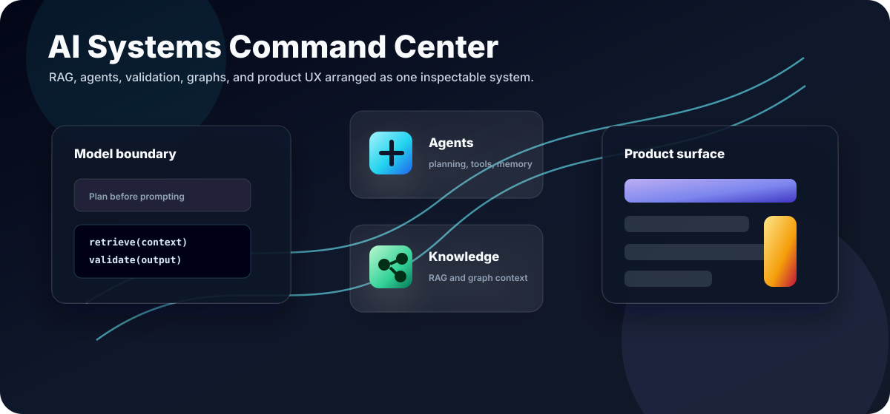
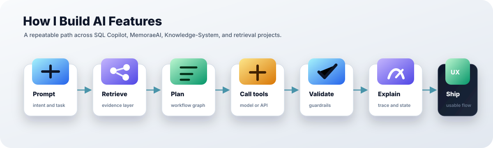
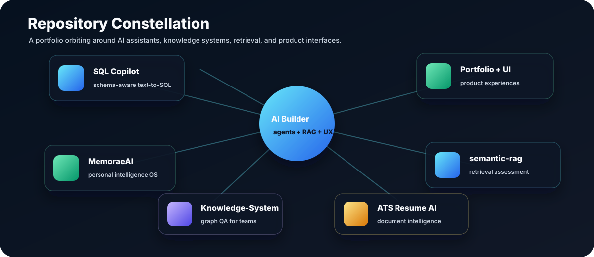

<p align="center">
  
</p>

<p align="center">
  
</p>

<p align="center">
  <a href="https://creativegaiety.netlify.app/">
    
  </a>
  <a href="https://www.linkedin.com/in/shashank-singh2003/">
    
  </a>
  <a href="mailto:singhshasank50@gmail.com">
    
  </a>
  <a href="https://github.com/shasanksingh?tab=repositories">
    
  </a>
</p>

<p align="center">
  
</p>

## Building AI Products With Engineering Boundaries

I build AI applications where the model is only one part of the system. My work usually combines retrieval, graph reasoning, workflow orchestration, deterministic validation, structured APIs, and product interfaces that make AI behavior easier to inspect.

<table>
  <tr>
    <td width="33%" valign="top">
      <h3>Agentic Systems</h3>
      <p>Planner-first workflows, tool routing, memory boundaries, fallback paths, and human-review checkpoints.</p>
    </td>
    <td width="33%" valign="top">
      <h3>RAG and Knowledge</h3>
      <p>Hybrid retrieval, vector search, schema grounding, knowledge graphs, evidence-aware responses, and explainable QA.</p>
    </td>
    <td width="33%" valign="top">
      <h3>AI Product UX</h3>
      <p>Dashboards, copilots, trace panels, confidence states, admin flows, and clean interfaces for complex AI systems.</p>
    </td>
  </tr>
</table>

<p align="center">
  
</p>

## Featured AI Systems

<table>
  <tr>
    <td width="50%" valign="top">
      <h3><a href="https://github.com/shasanksingh/sql-copilot">SQL Copilot</a></h3>
      <p>Enterprise text-to-SQL workspace with schema grounding, LangGraph workflow, NVIDIA GPT-OSS assist, deterministic fallback, confidence gating, dashboard analytics, and relationship graph UX.</p>
      <p>
        <code>Python</code> <code>Flask</code> <code>Next.js</code> <code>LangGraph</code> <code>RAG</code> <code>NVIDIA</code>
      </p>
    </td>
    <td width="50%" valign="top">
      <h3><a href="https://github.com/shasanksingh/MemoraeAI">MemoraeAI</a></h3>
      <p>Evidence-first personal intelligence operating system for messages, notes, calendars, tasks, projects, relationships, voice notes, and meeting recordings.</p>
      <p>
        <code>Python</code> <code>Agents</code> <code>Memory</code> <code>Knowledge</code> <code>Automation</code>
      </p>
    </td>
  </tr>
  <tr>
    <td width="50%" valign="top">
      <h3><a href="https://github.com/shasanksingh/Knowledge-System">Knowledge-System</a></h3>
      <p>Connected knowledge graph and explainable question-answering system for team knowledge management.</p>
      <p>
        <code>Python</code> <code>Knowledge Graph</code> <code>Explainable QA</code> <code>Retrieval</code>
      </p>
    </td>
    <td width="50%" valign="top">
      <h3><a href="https://github.com/shasanksingh/ats-resume-ai">ATS Resume AI</a></h3>
      <p>AI-powered resume analyzer with RAG, parsing, role-aware recommendations, ATS scoring, document optimization, and export workflows.</p>
      <p>
        <code>FastAPI</code> <code>RAG</code> <code>ChromaDB</code> <code>Sentence Transformers</code> <code>Next.js</code>
      </p>
    </td>
  </tr>
</table>

<p align="center">
  <a href="https://github.com/shasanksingh/sql-copilot">
    
  </a>
  <a href="https://github.com/shasanksingh/MemoraeAI">
    
  </a>
</p>

<p align="center">
  <a href="https://github.com/shasanksingh/Knowledge-System">
    
  </a>
  <a href="https://github.com/shasanksingh/ats-resume-ai">
    
  </a>
</p>

## Repository Map

<p align="center">
  
</p>

| Track | Repositories |
| --- | --- |
| AI copilots and agents | [sql-copilot](https://github.com/shasanksingh/sql-copilot), [linehold-refund-agent](https://github.com/shasanksingh/linehold-refund-agent), [paypilot-ai](https://github.com/shasanksingh/paypilot-ai) |
| Personal and team intelligence | [MemoraeAI](https://github.com/shasanksingh/MemoraeAI), [Knowledge-System](https://github.com/shasanksingh/Knowledge-System) |
| Retrieval and document AI | [ats-resume-ai](https://github.com/shasanksingh/ats-resume-ai), [semantic-rag-assessment](https://github.com/shasanksingh/semantic-rag-assessment) |
| Product frontends and UI systems | [Portfolio](https://github.com/shasanksingh/Portfolio), [growify-virtual-tryon](https://github.com/shasanksingh/growify-virtual-tryon), [vectorshift-frontend](https://github.com/shasanksingh/vectorshift-frontend) |
| Earlier full-stack experiments | [Encrypted-Web-Chat](https://github.com/shasanksingh/Encrypted-Web-Chat), [Phoneboook](https://github.com/shasanksingh/Phoneboook), [Qr-code-Scanner](https://github.com/shasanksingh/Qr-code-Scanner) |

## Stack I Reach For

<p align="center">
  
</p>

<p align="center">
  
  
  
</p>

## Current Direction

```text
AI product idea
  -> evidence and schema layer
  -> planner / workflow graph
  -> model or tool call
  -> validator and confidence gate
  -> UI that explains what happened
```

I am especially interested in systems that can answer from real context, ask for clarification when confidence is low, and expose their reasoning path without overwhelming the user.

<details>
  <summary><strong>Engineering principles I keep coming back to</strong></summary>
  <br />

Ground before generating.

Make model boundaries explicit.

Prefer typed contracts over hidden assumptions.

Design fallback paths as product features, not failure messages.

Build interfaces that let people inspect, correct, and trust the system.
</details>

## GitHub Activity

<p align="center">
  
  
  
</p>

<p align="center">
  
  
</p>

<p align="center">
  
</p>

## Connect

<p align="center">
  <a href="https://creativegaiety.netlify.app/">
    
  </a>
  <a href="https://www.linkedin.com/in/shashank-singh2003/">
    
  </a>
  <a href="mailto:singhshasank50@gmail.com">
    
  </a>
</p>

<p align="center">
  <strong>Building AI systems that are useful, inspectable, and ready to ship.</strong>
</p>

<p align="center">
  
</p>
