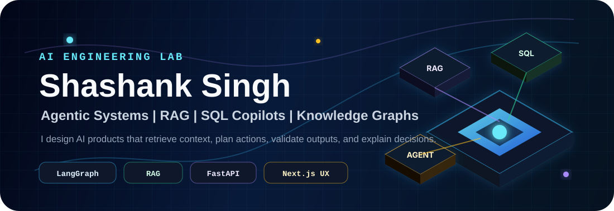
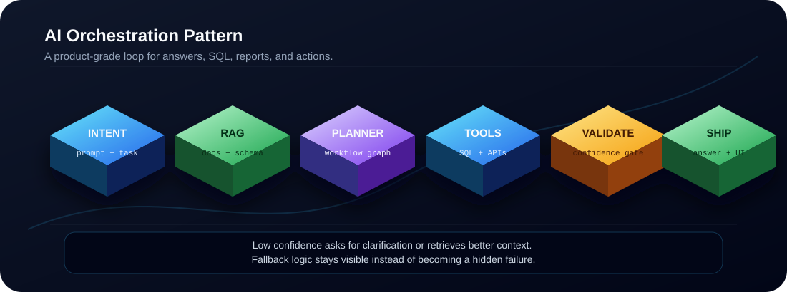
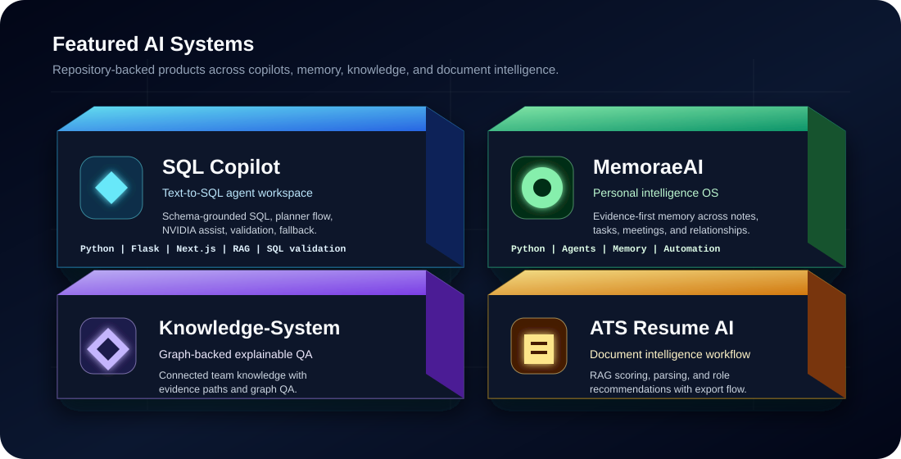
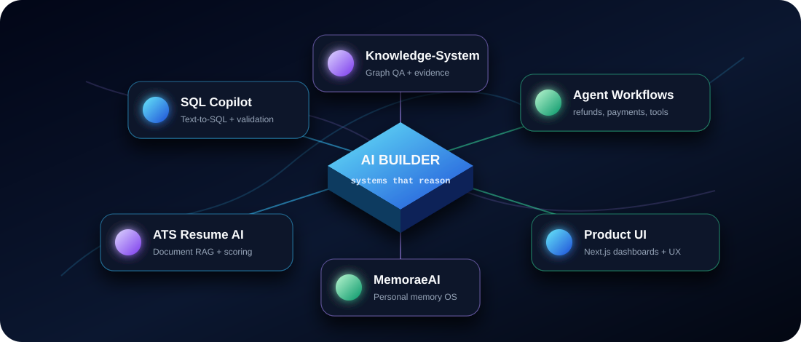
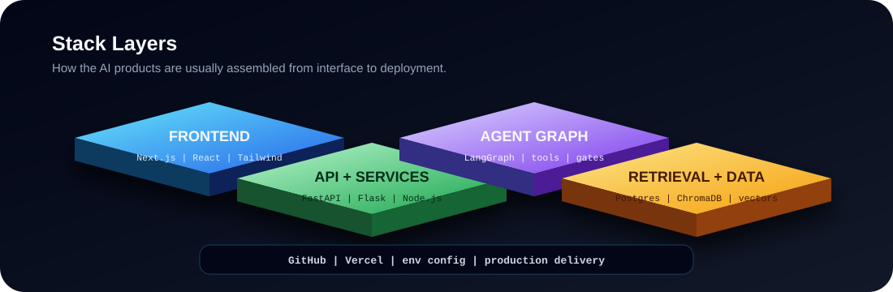

<p align="center">
  
</p>

<p align="center">
  <a href="https://creativegaiety.netlify.app/"><strong>Portfolio</strong></a>
  &nbsp;|&nbsp;
  <a href="https://www.linkedin.com/in/shashank-singh2003/"><strong>LinkedIn</strong></a>
  &nbsp;|&nbsp;
  <a href="mailto:singhshasank50@gmail.com"><strong>Email</strong></a>
  &nbsp;|&nbsp;
  <a href="https://github.com/shasanksingh?tab=repositories"><strong>AI Lab</strong></a>
</p>

## AI Engineer Building Systems That Think With Structure

I build AI products where the model is connected to a real workflow: retrieval, planning, tools, validation, memory boundaries, and a UI that explains what happened. My strongest work sits around SQL copilots, agentic workflows, knowledge systems, RAG pipelines, and AI-assisted product experiences.

I like building the layer around the LLM as much as the prompt itself: schema context, confidence gates, deterministic fallbacks, human clarification, observability, and interfaces that make AI behavior inspectable instead of mysterious.

| Focus | What I Build | Repositories |
| --- | --- | --- |
| Agentic copilots | Planner-based workflows, tool routing, model fallback, execution traces, confidence handling | [sql-copilot](https://github.com/shasanksingh/sql-copilot), [linehold-refund-agent](https://github.com/shasanksingh/linehold-refund-agent), [paypilot-ai](https://github.com/shasanksingh/paypilot-ai) |
| Retrieval and knowledge | RAG, semantic search, document grounding, knowledge graphs, explainable QA | [Knowledge-System](https://github.com/shasanksingh/Knowledge-System), [semantic-rag-assessment](https://github.com/shasanksingh/semantic-rag-assessment), [ats-resume-ai](https://github.com/shasanksingh/ats-resume-ai) |
| Personal intelligence | Memory-aware systems for notes, calendars, messages, relationships, and meeting context | [MemoraeAI](https://github.com/shasanksingh/MemoraeAI) |
| Product engineering | Frontend dashboards, workflow UI, automation panels, deployment-ready apps | [Portfolio](https://github.com/shasanksingh/Portfolio), [growify-virtual-tryon](https://github.com/shasanksingh/growify-virtual-tryon), [vectorshift-frontend](https://github.com/shasanksingh/vectorshift-frontend) |

<p align="center">
  
</p>

## Featured AI Systems

<p align="center">
  
</p>

### SQL Copilot

Enterprise text-to-SQL workspace focused on making database questions reliable and explainable.

What it highlights:

- Schema-aware natural language to SQL generation.
- LangGraph-style planning with validation and repair flow.
- NVIDIA LLM integration with deterministic fallback for resilience.
- RAG over Spider-style text-to-SQL examples for broader query understanding.
- Dashboard analytics, query history, confidence states, relationship graph modal, and UI trace panels.

Tech signal: `Python`, `Flask`, `Next.js`, `LangGraph`, `RAG`, `SQL validation`, `NVIDIA LLM API`.

### MemoraeAI

Evidence-first personal intelligence operating system for messages, notes, calendars, tasks, projects, relationships, voice notes, and meeting recordings.

What it highlights:

- Personal memory layer for fragmented daily context.
- Retrieval-first answers instead of unsupported generation.
- Relationship and preference awareness.
- Automation-friendly structure for tasks, projects, and meetings.

Tech signal: `Python`, `agents`, `memory`, `retrieval`, `personal knowledge`, `automation`.

### Knowledge-System

Connected knowledge graph and explainable QA system for team knowledge management.

What it highlights:

- Graph-shaped knowledge representation.
- Question answering that can point back to connected evidence.
- Team knowledge workflows where context is connected, not scattered.

Tech signal: `Python`, `knowledge graph`, `explainable QA`, `retrieval`, `team knowledge`.

### ATS Resume AI

AI-powered resume analyzer and optimizer with role-aware recommendations.

What it highlights:

- Resume parsing and structured scoring.
- RAG-backed recommendations.
- ATS-focused feedback and optimization flow.
- Export-oriented product workflow.

Tech signal: `FastAPI`, `RAG`, `ChromaDB`, `Sentence Transformers`, `document AI`, `Next.js`.

## AI Architecture Style

```text
User intent
  -> context retrieval
  -> planner or workflow graph
  -> model / tool execution
  -> deterministic validator
  -> clarification when confidence is low
  -> answer, SQL, report, or UI action
```

I try to keep AI systems grounded in four things:

- Evidence before generation: answer from schema, documents, graph nodes, or examples whenever possible.
- Clear fallback paths: deterministic logic is part of the product, not just an error handler.
- Confidence-aware UX: high confidence should execute, low confidence should ask better questions.
- Inspectable output: users should see the reasoning trail, selected context, validation status, and next action.

<p align="center">
  
</p>

## Repository Constellation

| Area | Projects | Why It Matters |
| --- | --- | --- |
| SQL and data copilots | [sql-copilot](https://github.com/shasanksingh/sql-copilot), [GE-COPILOT](https://github.com/shasanksingh/GE-COPILOT) | Turns business questions into validated database workflows and dashboard actions. |
| Memory and knowledge | [MemoraeAI](https://github.com/shasanksingh/MemoraeAI), [Knowledge-System](https://github.com/shasanksingh/Knowledge-System) | Connects user, team, and document context into searchable reasoning systems. |
| RAG and document AI | [ats-resume-ai](https://github.com/shasanksingh/ats-resume-ai), [semantic-rag-assessment](https://github.com/shasanksingh/semantic-rag-assessment) | Grounds recommendations and answers in retrieved evidence. |
| Agent workflows | [linehold-refund-agent](https://github.com/shasanksingh/linehold-refund-agent), [paypilot-ai](https://github.com/shasanksingh/paypilot-ai) | Explores task automation, payment/refund assistance, and tool-driven flows. |
| Product interfaces | [Portfolio](https://github.com/shasanksingh/Portfolio), [growify-virtual-tryon](https://github.com/shasanksingh/growify-virtual-tryon), [vectorshift-frontend](https://github.com/shasanksingh/vectorshift-frontend) | Turns AI logic into interfaces people can actually use. |
| Earlier engineering base | [Encrypted-Web-Chat](https://github.com/shasanksingh/Encrypted-Web-Chat), [Phoneboook](https://github.com/shasanksingh/Phoneboook), [Qr-code-Scanner](https://github.com/shasanksingh/Qr-code-Scanner) | Full-stack foundations across auth, realtime-style UX, APIs, and browser apps. |

## Stack And Tooling

<p align="center">
  
</p>

| Layer | Tools I Use |
| --- | --- |
| Languages | `Python`, `TypeScript`, `JavaScript`, `SQL` |
| AI workflow | `LangGraph`, `RAG`, `semantic search`, `tool calling`, `validation gates`, `fallback routing` |
| Backend | `FastAPI`, `Flask`, `Node.js`, `REST APIs`, `auth`, `structured services` |
| Frontend | `Next.js`, `React`, `Tailwind CSS`, dashboards, modals, relationship graphs, trace panels |
| Data | `PostgreSQL`, `SQLite`, `ChromaDB`, vector indexes, schema metadata |
| Delivery | `Git`, `GitHub`, `Vercel`, environment configuration, production deployment flow |

## What I Am Improving Next

- More reliable agent execution with clear state machines and retry boundaries.
- Better RAG evaluation using synthetic samples and real user query patterns.
- AI dashboards that explain model decisions without making the UI heavy.
- Schema-aware copilots that know when to answer, when to ask, and when to refuse unsupported SQL.
- Personal and team intelligence systems that treat memory as evidence, not magic.

## Contact

I am interested in AI product engineering, agentic workflow systems, retrieval-heavy applications, and practical LLM integrations that ship as real software.

<p align="center">
  <a href="https://creativegaiety.netlify.app/">Portfolio</a>
  &nbsp;|&nbsp;
  <a href="https://www.linkedin.com/in/shashank-singh2003/">LinkedIn</a>
  &nbsp;|&nbsp;
  <a href="mailto:singhshasank50@gmail.com">singhshasank50@gmail.com</a>
  &nbsp;|&nbsp;
  <a href="https://github.com/shasanksingh?tab=repositories">GitHub Repositories</a>
</p>

<p align="center">
  <strong>Building AI systems that retrieve, reason, validate, and explain.</strong>
</p>
