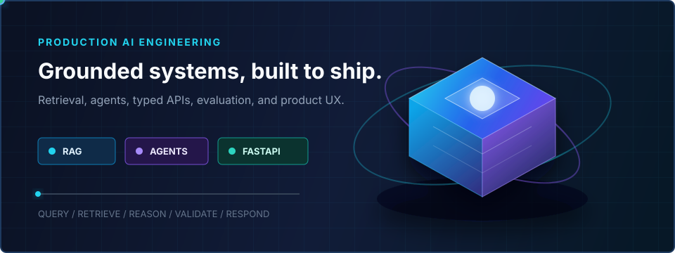
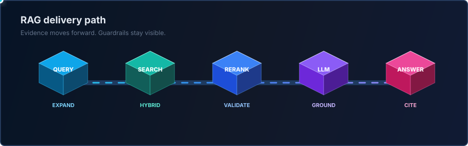
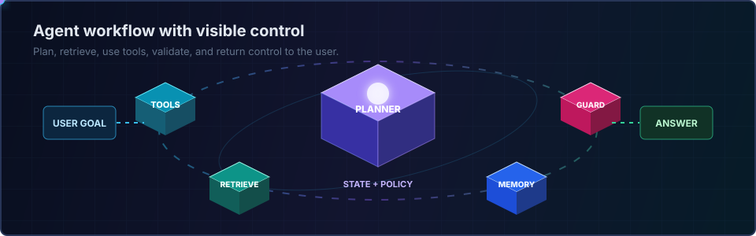

  

  

  
  
  

<table>
  <tr>
    <td width="64%" valign="middle">
      <h2>AI systems with product discipline</h2>
      

        I am a Product Engineer at <strong>Tata Consultancy Services</strong>, focused on turning AI capabilities into dependable products. My work combines retrieval, agent workflows, typed backend services, evaluation, and interfaces that make system behavior understandable.
      

      

        <strong>Current focus:</strong> production RAG, AI copilots, FastAPI services, local models, vector search, and intelligent automation.
      

    </td>
    <td width="36%" align="center" valign="middle">
      
    </td>
  </tr>
</table>

  

  
  
  

## 🧩 What I Build

<table>
  <tr>
    <td width="33%" valign="top">
      <h3>🔎 Retrieval systems</h3>
      
Chunking, embeddings, hybrid search, vector indexes, reranking, grounded generation, and citation-ready responses.

    </td>
    <td width="33%" valign="top">
      <h3>🧠 Agents and copilots</h3>
      
Planning, tool use, schema awareness, validation, memory, and human review for practical workflows.

    </td>
    <td width="33%" valign="top">
      <h3>⚙️ AI product backends</h3>
      
FastAPI services, typed contracts, model orchestration, PostgreSQL boundaries, deployment, and observable failure states.

    </td>
  </tr>
</table>

## 🔄 Production RAG Flow

  

The pipeline is treated as an engineered system: expand the request, retrieve evidence, rerank context, constrain generation, and return an answer that can be inspected.

## 🤖 Agent Workflow

  

The agent loop keeps planning, retrieval, memory, tool use, and validation visible instead of hiding the workflow behind one prompt.

## 🧰 Technology Stack

### AI and retrieval

### Backend and data

### Product frontend

## 🚀 Featured Work

<table>
  <tr>
    <td width="50%" valign="top">
      <h3>📄 <a href="https://github.com/shasanksingh/ats-resume-ai">ATS Resume AI</a></h3>
      
Resume intelligence system with parsing, ATS checks, role-aware retrieval, grounded recommendations, optimization, and document export.

      
<code>FastAPI</code> <code>Next.js</code> <code>RAG</code> <code>ChromaDB</code> <code>Local models</code>

    </td>
    <td width="50%" valign="top">
      <h3>🗄️ <a href="https://github.com/shasanksingh/sql-copilot">SQL Copilot</a></h3>
      
Schema-aware analytical copilot that plans intent, generates safer SQL, validates assumptions, and explains results.

      
<code>Python</code> <code>SQL</code> <code>LLM</code> <code>Validation</code> <code>FastAPI</code>

    </td>
  </tr>
  <tr>
    <td width="50%" valign="top">
      <h3>🔬 <a href="https://github.com/shasanksingh/semantic-rag-assessment">Semantic RAG Assessment</a></h3>
      
Focused retrieval implementation for embeddings, semantic matching, vector search, and grounded context preparation.

      
<code>Python</code> <code>Embeddings</code> <code>Vector search</code> <code>RAG</code>

    </td>
    <td width="50%" valign="top">
      <h3>🌐 <a href="https://github.com/shasanksingh/Portfolio">AI Engineering Portfolio</a></h3>
      
Multi-page product portfolio with research notes, interactive AI architecture, 3D visuals, and static Netlify delivery.

      
<code>Next.js</code> <code>TypeScript</code> <code>Three.js</code> <code>Framer Motion</code>

    </td>
  </tr>
</table>

  
  

## 🛠️ Currently Building

<table>
  <tr>
    <td width="50%" valign="top">
      <h3>📄 ATS Resume AI</h3>
      
Improving grounded role guidance, section-level recommendations, document rebuilding, and evidence-aware evaluation.

      
<code>RAG</code> <code>FastAPI</code> <code>Local models</code> <code>Next.js</code>

    </td>
    <td width="50%" valign="top">
      <h3>🧭 Copilots and agent workflows</h3>
      
Exploring schema-aware planning, constrained tool use, human review, memory boundaries, and observable execution traces.

      
<code>Agents</code> <code>SQL</code> <code>Validation</code> <code>Observability</code>

    </td>
  </tr>
</table>

  
<strong>Engineering principles I optimize for</strong>

   

  - Ground before generating.
  - Keep tool boundaries explicit.
  - Prefer typed contracts and reviewable outputs.
  - Measure retrieval and failure behavior, not only response style.
  - Make AI behavior understandable to the person using it.

## 📊 GitHub Activity

  
  

  

## 🤝 Connect

  
  
  

  <strong>Building AI products that are useful, inspectable, and ready to ship.</strong>

  

